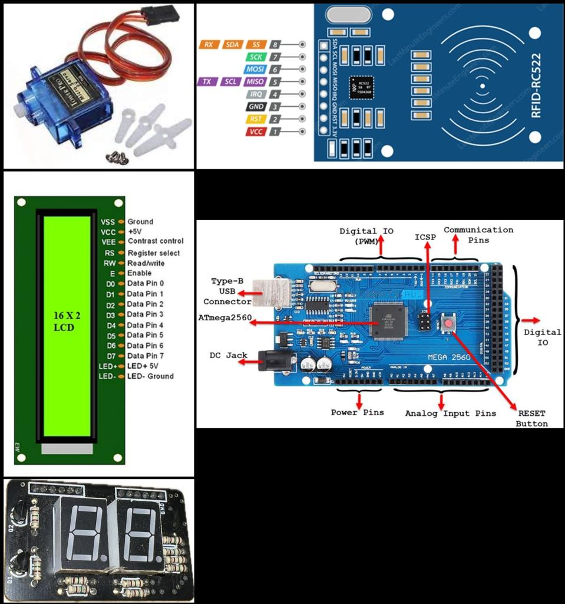

# Metro Gate Prototype

The Metro Gate Prototype project is a simple hardware project that simulates a metro gate system using RFID technology, Arduino Mega 2560, LCD displays, 7-segment LED display, servo motors, LEDs, and a buzzer.

## Table of Contents

- [Hardware Components](#hardware-components)
- [Project Overview](#project-overview)
- [Pin Connections](#pin-connections)
- [Setup Instructions](#setup-instructions)
- [Usage](#usage)
- [Contributing](#contributing)
- [License](#license)

## Hardware Components

The project uses the following hardware components:

- 2 RFID (RC522) Modules
- 1 Arduino Mega 2560
- 2 LCD Displays (16x2)
- 1 7-Segment LED Display
- 2 Servo Motors
- 2 Green LEDs
- 2 Red LEDs
- 1 Buzzer

## Project Overview

The Metro Gate Prototype project emulates a metro gate system, allowing users to swipe RFID cards to enter and exit. It provides visual and audio feedback with LEDs and a buzzer. The 7-segment LED display shows the current gate count.

## Pin Connections

Here are the pin connections used in the project:

- **Buzzer 1**: Pin 2
- **Green LED 1**: Pin 31
- **Red LED 1**: Pin 30
- **Buzzer 2**: Pin 42
- **Green LED 2**: Pin 44
- **Red LED 2**: Pin 39
- **LCD 1**: Pins (22, 23, 24, 25, 26, 27)
- **LCD 2**: Pins (32, 33, 34, 35, 36, 37)
- **RFID Module 1**: Pins (5, 28, 51, 50, 53)
- **RFID Module 2**: Pins (6, 38, 51, 50, 53)
- **Servo Motor 1**: Pin 8
- **Servo Motor 2**: Pin 11
- **7-Segment Display**: Pins (16, 17, 18, 19, 20, 21)

## Setup Instructions

To set up the Metro Gate Prototype, follow these steps:

1. Connect the hardware components based on the provided pin connections.

2. Upload the provided system program code to your Arduino Mega 2560 using the Arduino IDE.

3. Power up the system.

## Usage

- Swipe RFID cards on the RFID modules to simulate entry and exit.

- LEDs will indicate successful entry and exit.

- The 7-segment LED display will show the current gate count.

- The buzzer will sound when a successful entry is made.

## Contributing

Contributions to this project are welcome. If you have ideas for improvements, bug fixes, or additional features, please feel free to fork this repository, make your changes, and submit a pull request.

## License

This project is open-source and available under the [MIT License](LICENSE). You are free to use, modify, and distribute this codebase as needed.

Thank you for exploring the Metro Gate Prototype project. Happy prototyping!
